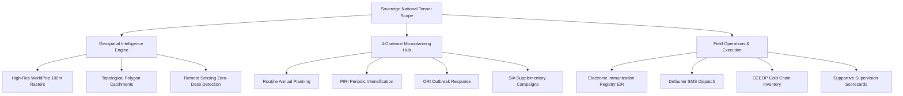

# VaxPlan Enterprise Platform — Comprehensive End-User Manual & Operational Handbook

```
========================================================================================
   ██╗   ██╗ █████╗ ██╗  ██╗██████╗ ██╗      █████╗ ███╗   ██╗
   ██║   ██║██╔══██╗╚██╗██╔╝██╔══██╗██║     ██╔══██╗████╗  ██║
   ██║   ██║███████║ ╚███╔╝ ██████╔╝██║     ███████║██╔██╗ ██║
   ╚██╗ ██╔╝██╔══██║ ██╔██╗ ██╔═══╝ ██║     ██╔══██║██║╚██╗██║
    ╚████╔╝ ██║  ██║██╔╝ ██╗██║     ███████╗██║  ██║██║ ╚████║
     ╚═══╝  ╚═╝  ╚═╝╚═╝  ╚═╝╚═╝     ╚══════╝╚═╝  ╚═╝╚═╝  ╚═══╝
   Geospatial Microplanning, Zero-Dose Targeting & Campaign Operations
========================================================================================
```

> **Target Audience**: Community Health Workers (CHWs), Facility Clerks, Health Facility In-Charges, District Health Management Teams (DHMT), Provincial/Regional Coordinators, National Expanded Programme on Immunization (EPI) Directors, GIS Officers, and Platform Administrators.  
> **Document Version**: 2.5.0 Enterprise Edition  
> **Platform Version**: VaxPlan Enterprise v1.9.4+  
> **Standards Alignment**: WHO/UNICEF Reaching Every District (RED) & Reaching Every Community (REC), WHO CCEOP Cold Chain Protocols, DHIS2 ADX/DataValueSets.

---

## Table of Contents

1. [Executive Overview & Architectural Foundations](#1-executive-overview--architectural-foundations)
2. [Role-Based Access Control (RBAC) & User Personas](#2-role-based-access-control-rbac--user-personas)
3. [Module 1: Geospatial Catchment Mapping & Topological Polygon Digitization](#3-module-1-geospatial-catchment-mapping--topological-polygon-digitization)
   - 3.1 [Health Facility Catchment Digitization](#31-health-facility-catchment-digitization)
   - 3.2 [Community Sub-Polygon Demarcation with Live Snapping](#32-community-sub-polygon-demarcation-with-live-snapping)
   - 3.3 [1-Click Auto-Clip to Free Space (`⚡ Auto-Clip`)](#33-1-click-auto-clip-to-free-space--auto-clip)
   - 3.4 [Missed Communities & Zero-Dose Gap Remediation](#34-missed-communities--zero-dose-gap-remediation)
   - 3.5 [WorldPop Zonal Statistics & Population Cascade](#35-worldpop-zonal-statistics--population-cascade)
4. [Module 2: 4-Cadence Microplanning Wizard & Proximity Clash Validator](#4-module-2-4-cadence-microplanning-wizard--proximity-clash-validator)
   - 4.1 [The 4 Immunization Cadences (Routine, PIRI, ORI, SIA)](#41-the-4-immunization-cadences-routine-piri-ori-sia)
   - 4.2 [Step-by-Step 4-Stage Microplan Authoring](#42-step-by-step-4-stage-microplan-authoring)
   - 4.3 [Session Scheduling & Automated 5km Proximity Clash Detection](#43-session-scheduling--automated-5km-proximity-clash-detection)
5. [Module 3: Electronic Immunization Registry (EIR) & Defaulter Tracing Logbook](#5-module-3-electronic-immunization-registry-eir--defaulter-tracing-logbook)
   - 5.1 [Infant & Caregiver Master Registration](#51-infant--caregiver-master-registration)
   - 5.2 [Vaccination Logging & Antigen Administration](#52-vaccination-logging--antigen-administration)
   - 5.3 [Automated Defaulter Detection & Multi-Channel SMS Alerts](#53-automated-defaulter-detection--multi-channel-sms-alerts)
6. [Module 4: Supportive Supervision 7-Domain Quality Framework](#6-module-4-supportive-supervision-7-domain-quality-framework)
   - 6.1 [The 7 Evaluation Domains & Scoring Rubric](#61-the-7-evaluation-domains--scoring-rubric)
   - 6.2 [Conducting Field Assessments (WHO 35-Q & National 70-Q Checklists)](#62-conducting-field-assessments-who-35-q--national-70-q-checklists)
   - 6.3 [Executive Facility Scorecards & Action Item Management](#63-executive-facility-scorecards--action-item-management)
7. [Module 5: Cold Chain Equipment (CCE) Inventory & Vaccine Stock Ledgers](#7-module-5-cold-chain-equipment-cce-inventory--vaccine-stock-ledgers)
8. [Module 6: Offline-First Operation, Service Worker PWA & Local IndexedDB Outbox](#8-module-6-offline-first-operation-service-worker-pwa--local-indexeddb-outbox)
9. [Module 7: Health Information Systems (HIS) & DHIS2 Bi-Directional Synchronization](#9-module-7-health-information-systems-his--dhis2-bi-directional-synchronization)
10. [Module 8: Vaccine-Preventable Disease (VPD) Surveillance & Outbreak Risk Scoring](#10-module-8-vaccine-preventable-disease-vpd-surveillance--outbreak-risk-scoring)
11. [Master Keyboard Shortcuts & Quick-Action Cheat Sheet](#11-master-keyboard-shortcuts--quick-action-cheat-sheet)
12. [Troubleshooting Guide & Standard Operating Procedures (SOPs)](#12-troubleshooting-guide--standard-operating-procedures-sops)

---

## 1. Executive Overview & Architectural Foundations

VaxPlan is a state-of-the-art digital health intelligence platform purpose-built to transition national immunization programs from static, fragmented paper spreadsheets into an **enterprise, geospatial, real-time microplanning and execution engine**.



### Core Architectural Pillars:
- **Strict Multi-Tenant Isolation**: Cryptographic tenant boundaries guarantee that sovereign health data, national master facility lists, and target demographics remain strictly partitioned by country.
- **Topological Precision**: Boundaries and catchments conform to strict PostGIS spatial validation rules—preventing polygon overlaps, eliminating sliver gaps, and calculating high-resolution zonal statistics directly from 100m WorldPop population rasters.
- **Offline-First Resilience**: Designed for extreme field operating conditions. Field workers in remote valleys or disconnected health posts capture vaccinations, log cold chain temperatures, and update session sheets offline. All transactions queue in IndexedDB outbox storage and synchronize automatically upon network restoration.
- **Interoperability Standards**: Native support for DHIS2 aggregate reporting via ADX and DataValueSets protocols, allowing bidirectional exchange of immunization coverage data.

---

## 2. Role-Based Access Control (RBAC) & User Personas

VaxPlan enforces granular, hierarchical permissions. The user interface automatically adapts to your designated role:

| Role Title | Scope | Key Capabilities & Daily Focus |
| :--- | :--- | :--- |
| **Community Health Worker (CHW)** | Community / Settlement | Household enumeration, door-to-door mobilization, client defaulter tracing, and offline attendance recording. |
| **Facility Clerk** | Single Facility | Authors quarterly microplans, records vaccinations in client logbooks, logs stock receipts, transfers, and vial wastage. |
| **Facility In-Charge** | Single Facility | Approves and locks catchment boundaries, authorizes session itineraries, closes daily summary sheets, and reviews stock alerts. |
| **District Manager (DHMT)** | District / County | Evaluates and approves facility microplans, conducts supportive supervision visits, audits zero-dose settlement clusters. |
| **Provincial Coordinator** | Province / Region | Monitors regional vaccine buffer stocks, conducts cross-district performance rollups, and signs off on multi-district SIA campaigns. |
| **National EPI Manager** | Entire Country | Sets national strategic targets, configures vaccine schedules and wastage coefficients, triggers DHIS2 sync, reviews VPD surveillance risk maps. |
| **GIS Specialist** | Entire Country | Digitizes primary health catchments, ingests custom GeoJSON administrative layers, resolves boundary overlaps, and harmonizes GIS polygons. |
| **Platform Super Admin** | Global / Multi-Tenant | Provisions national tenants, manages single sign-on (SSO), monitors system audit logs and infrastructure health. |

---

## 3. Module 1: Geospatial Catchment Mapping & Topological Polygon Digitization

The **Catchment Map & Polygon Drawing** workspace enables health facility staff and GIS cartographers to trace operational boundaries with mathematical topological precision.


### 3.1 Health Facility Catchment Digitization
1. Open **Facilities** from the sidebar and select the target facility.
2. Scroll to the **Catchment Map & Communities** workspace.
3. Click **"Draw HF Catchment"** (or click **"Extract Communities"** to automatically scrape settlement points and generate suggested buffers).
4. Left-click along roads, rivers, and natural landmarks to place vertices.
5. **Double-click** the final point to close the boundary.
6. The system instantly queries the high-resolution WorldPop population raster and displays the estimated total population and under-5 cohort headcount.
7. Click **"Save & Lock"** to persist the boundary.

### 3.2 Community Sub-Polygon Demarcation with Live Snapping
1. In the **Community** dropdown selector, choose the target village or community name.
2. Click **"Draw Polygon"**.
3. Trace the boundary inside the parent facility catchment.
4. **Live Emerald Snapping**: When your cursor approaches within 18 pixels of the outer facility perimeter or an existing sibling village border, a glowing **emerald green marker (`🟢`)** appears, magnetically snapping your click to the exact line. This prevents microscopic sliver gaps and overlaps.
5. Double-click to close the polygon.

### 3.3 1-Click Auto-Clip to Free Space (`⚡ Auto-Clip`)
If a newly digitized polygon accidentally intersects an existing adjacent community:
1. An overlap notification banner will alert you to the collision.
2. Click the **"⚡ Auto-Clip to Free Space"** button on the toolbar.
3. VaxPlan's server-side spatial engine calculates the Boolean geometric difference (`turf.difference` / `turf.intersect`) against all sibling boundaries.
4. Overlapping segments are trimmed away instantly, perfectly preserving the adjacent borders with zero manual vertex adjustment.

### 3.4 Missed Communities & Zero-Dose Gap Remediation
1. Inspect the **🎯 Missed Communities & Gap Analysis** dashboard below the map.
2. The engine categorizes all known settlement clusters:
   - **Enclosed**: Properly zoned inside an active community sub-polygon.
   - **Unzoned In-Catchment (Amber `🟠`)**: Inside the health facility boundary but not covered by any village sub-polygon (visualized as a red-hatched interior overlay).
   - **Orphaned Zero-Dose (Red `🔴`)**: Settlements located completely outside all known health facility catchments.
3. Click on any flagged settlement in the listing to view its population and distance, then adjust community borders to encompass the unreached population.

### 3.5 WorldPop Zonal Statistics & Population Cascade
Whenever a polygon is closed, VaxPlan triggers a multi-tier population estimation cascade:
1. **Local GeoTIFF / PostGIS Raster**: Directly sums 100m grid cell population weights.
2. **WorldPop WOPR API**: Fetches probabilistic demographic pyramids (under-1, under-5, pregnant women).
3. **WorldPop REST Service**: Fallback endpoint for real-time raster zonal statistics.
4. **Density Fallback**: Uses national administrative density averages if remote APIs are temporarily unreachable.

---

## 4. Module 2: 4-Cadence Microplanning Wizard & Proximity Clash Validator

VaxPlan provides full operational workflows for all 4 immunization delivery modalities mandated by WHO/UNICEF guidelines.


### 4.1 The 4 Immunization Cadences
- **Routine Immunization (RI)**: Fixed weekly health post sessions, monthly mobile clinics, and scheduled school vaccination rounds.
- **Periodic Intensification of Routine Immunization (PIRI)**: Catch-up campaigns targeting dropouts and under-immunized clusters in remote or seasonal settlements.
- **Outbreak Response Immunization (ORI)**: Emergency reactive ring vaccination triggered by confirmed VPD signals (e.g., Measles, Polio, Cholera).
- **Supplementary Immunization Activities (SIA)**: National or sub-national mass campaign days delivering supplemental antigen doses across entire age cohorts.

### 4.2 Step-by-Step 4-Stage Microplan Authoring
1. **Stage 1: Baseline Targets**: Define target cohorts (Total Population, Surviving Infants <1yr, Under-5 Children, Pregnant Women). Target numbers can be auto-filled from WorldPop raster statistics.
2. **Stage 2: Cadence Strategy**: Select the active cadence (Routine, PIRI, ORI, SIA) and configure session frequencies (Fixed Post, Outreach, Mobile, House-to-House).
3. **Stage 3: Session Scheduling & Calendar**: Assign session dates, target venues (schools, churches, water points), assigned vaccinator teams, and allocated cold boxes.
4. **Stage 4: Budget & Resource Forecast**: Auto-calculate per diems, fuel allowances, transport costs, and cold chain capacity requirements based on national standard cost matrices.

### 4.3 Session Scheduling & Automated 5km Proximity Clash Detection
To prevent logistical clashes and team double-booking:
- When a new outreach session is scheduled, the engine calculates spatial distances to all other sessions scheduled on the same date.
- **5km Clash Warning (`⚠️`)**: If two outreach sessions are scheduled within 5km of each other on the same calendar day, the system flags a **Proximity Conflict Alert**, prompting planners to stagger dates or merge teams to optimize fuel and staff utilization.

---

## 5. Module 3: Electronic Immunization Registry (EIR) & Defaulter Tracing Logbook

The EIR provides an intuitive, high-speed digital registry for recording child immunization encounters and tracking defaulters.


### 5.1 Infant & Caregiver Master Registration
1. Navigate to **Client Logbook** -> Click **"Register New Child"**.
2. Input child demographic data:
   - Full Name, Gender, Date of Birth (DOB).
   - Mother/Caregiver Name, National ID / Phone Number.
   - Residential Community / Village and GIS coordinates (or drop map pin).
3. The platform generates a unique cryptographic Client Identifier and QR Code.

### 5.2 Vaccination Logging & Antigen Administration
1. Search for a child by Name, Caregiver Phone, or Scan their QR Code.
2. The child’s digital vaccination card opens, displaying the national immunization schedule matrix (BCG, OPV, Penta 1-3, PCV 1-3, Rota 1-2, IPV, Measles-Rubella 1-2, HPV).
3. Check the administered antigen box, select the vaccine batch/lot number, and click **"Record Dose"**.
4. The system validates dosing intervals (e.g., minimum 28 days between Penta 1 and Penta 2) and calculates the next scheduled return date.

### 5.3 Automated Defaulter Detection & Multi-Channel SMS Alerts
- **Dropout Analytics**: The platform continuously monitors dropouts between key antigen pairs (e.g., Penta1 vs Penta3, BCG vs MR2).
- **Automated Defaulter Lists**: Children who miss their appointment by >14 days are automatically escalated to the **Defaulter Tracing Logbook**.
- **1-Click SMS Reminder**: Click **"Send SMS"** to dispatch localized reminder text messages to the caregiver's registered phone number.
- **Dispatch CHW**: Click **"Dispatch CHW"** to route the child's household location directly to the Community Health Worker's mobile field workspace.

---

## 6. Module 4: Supportive Supervision 7-Domain Quality Framework

VaxPlan implements a standardized, quantitative supervision system to evaluate facility operational readiness.


### 6.1 The 7 Evaluation Domains & Scoring Rubric
1. **Planning & Microplanning Quality (15%)**: Currency of microplans, session schedules, and population target accuracy.
2. **Vaccine Management & Cold Chain Integrity (20%)**: Daily 30DTR temperature logs, VVM stage compliance, and stock ledger reconciliation.
3. **Service Delivery & Injection Safety (20%)**: Sterile technique, AEFI emergency kit availability, and sharps container management.
4. **Data Quality, Monitoring & Logbook Accuracy (15%)**: Register completeness, tally sheet reconciliation, and DHIS2 reporting timeliness.
5. **Community Engagement & Demand Generation (10%)**: Engagement with local chiefs, village health committees, and religious leaders.
6. **AEFI Surveillance & Case Reporting (10%)**: Knowledge of adverse event reporting protocols and notification compliance.
7. **Programme Governance & Leadership (10%)**: Timely team meetings, supportive review frequency, and budget accountability.

### 6.2 Conducting Field Assessments
1. Navigate to **Supervision** -> Click **"Conduct Visit"**.
2. Select target Health Facility and Supervisor Name.
3. Choose the standardized checklist template:
   - **WHO Short Form (35 Questions)**: Optimized for rapid quarterly monitoring visits.
   - **National Full Framework (70 Questions)**: Comprehensive annual quality evaluation.
4. Complete question responses with numeric ratings, observations, and photo attachments.

### 6.3 Executive Facility Scorecards & Action Item Management
- **Traffic Light Scoring**:
  - 🟢 **Low Risk (>= 80.0%)**: Facility meets high national operational standards.
  - 🟠 **Medium Risk (50.0% – 79.9%)**: Moderate performance with specific corrective actions needed.
  - 🔴 **High Risk (< 50.0%)**: Critical deficiencies requiring immediate district intervention.
- **Action Item Tracker**: Supervisors create time-bound corrective action items with assigned owners and automated deadline reminders.

---

## 7. Module 5: Cold Chain Equipment (CCE) Inventory & Vaccine Stock Ledgers

- **CCEOP Standard Equipment Tracking**: Manage cold chain fridges, freezers, solar direct drive (SDD) systems, and vaccine carriers by make, model, serial number, and WHO PQS code.
- **Real-Time Storage Volume Calculations**: Evaluates net positive (+2°C to +8°C) and negative (-20°C) storage capacity against required campaign doses to prevent storage overflow.
- **30-Day Temperature Recording (30DTR)**: Log twice-daily temperature checks with automatic alerts for freeze excursions (<0°C) or heat excursions (>8°C).
- **Vaccine Stock Ledger & Wastage Calculator**: Tracks physical stock on hand, batches, expiry dates, and calculates operational wastage rates against national benchmarks.

---

## 8. Module 6: Offline-First Operation, Service Worker PWA & Local IndexedDB Outbox

VaxPlan is engineered to provide seamless operational capability in zero-connectivity environments.

```
┌──────────────────────────────────────────────────────────────────────────┐
│                   OFFLINE FIELD DATA SYNCHRONIZATION                     │
├──────────────────────────────────────────────────────────────────────────┤
│                                                                          │
│  [Field Worker / Tablet] ───► Local IndexedDB Storage (PWA Cache)         │
│                                    │                                     │
│  (Captures: EIR Doses,             ▼                                     │
│   Microplans, Supervision)    [Outbox Queue]                             │
│                                    │                                     │
│                                    ▼ (Network Reconnected)               │
│                               [Sync Engine]                              │
│                                    │                                     │
│                                    ▼                                     │
│                 [VaxPlan Cloud / PostGIS Enterprise DB]                  │
│                                                                          │
└──────────────────────────────────────────────────────────────────────────┘
```

1. **Progressive Web App (PWA) Installation**: Open VaxPlan in Chrome or Safari and click **"Install App"** to pin VaxPlan to your home screen.
2. **Offline Data Capture**: When disconnected from the internet, an amber **"Offline Mode"** badge appears. You can author microplans, register infants, and log doses without interruption.
3. **Cryptographic Device Tokens**: Devices authenticate via secure offline device tokens.
4. **Automatic Background Sync**: As soon as the device detects internet connectivity, the synchronization engine flushes all queued transactions in chronological order.

---

## 9. Module 7: Health Information Systems (HIS) & DHIS2 Bi-Directional Synchronization

- **ADX / DataValueSets Protocols**: Natively formats aggregate immunization metrics into standardized DHIS2 XML and JSON payloads.
- **Org Unit & Data Element Mapping**: Connect national DHIS2 organization unit UIDs and data element codes directly to VaxPlan health facilities and antigen indicators.
- **Payload Inspection & Audit Trail**: Review preview payloads before pushing, with complete historical logs of all successful and failed synchronization jobs.

---

## 10. Module 8: Vaccine-Preventable Disease (VPD) Surveillance & Outbreak Risk Scoring

- **Integrated Case Surveillance**: Log suspected cases of Measles, Acute Flaccid Paralysis (Polio), Yellow Fever, Cholera, and Neonatal Tetanus.
- **Multi-Criteria Epidemic Risk Scoring (0–100)**: Combines historical dropout rates, population density, zero-dose cluster proximity, and recent case notifications into a composite geographic risk index.
- **Outbreak Response (ORI) Auto-Trigger**: High-risk notifications automatically propose targeted ring vaccination microplans to contain transmission.

---

## 11. Master Keyboard Shortcuts & Quick-Action Cheat Sheet

| Feature / Workspace | Key Combination | Action Description |
| :--- | :--- | :--- |
| **Polygon Drawing** | `Left Click` | Place a new vertex along boundary or road. |
| **Polygon Drawing** | `Double Click` | Close and finalize the current polygon. |
| **Polygon Drawing** | `Ctrl + Z` / `Cmd + Z` | Undo the last placed vertex point. |
| **Polygon Drawing** | `Escape` (`Esc`) | Cancel drawing mode without saving. |
| **Polygon Drawing** | `🟢 Snap Marker` | Snaps vertex to neighboring border at 18px threshold. |
| **Global Navigation** | `Ctrl + K` / `Cmd + K` | Open global omnibar search across facilities and villages. |
| **Data Tables** | `Shift + Click` | Multi-sort table columns (ascending / descending). |
| **EIR Register** | `Enter` | Save dose and advance to next child in queue. |

---

## 12. Troubleshooting Guide & Standard Operating Procedures (SOPs)

### Problem 1: "Polygon Overlap Blocked" Error
- **Cause**: A drawn community polygon overlaps with an existing approved neighbor.
- **Solution**: Click the **`⚡ Auto-Clip to Free Space`** button on the toolbar. The server will automatically compute the Boolean difference and trim the overlapping border cleanly.

### Problem 2: "Proximity Conflict Warning" on Outreach Session
- **Cause**: Another outreach team is scheduled within 5km of your proposed venue on the same date.
- **Solution**: Open the **Session Planning** calendar, inspect the conflicting session, and reschedule your session to a different date or merge teams.

### Problem 3: Offline Sync Queue Has Pending Items
- **Cause**: Device has been offline or network was interrupted during data transfer.
- **Solution**: Ensure internet connection is restored, navigate to **Settings -> Offline Hub**, and click **"Sync Outbox Now"**.

---

*VaxPlan Enterprise Manual — Ministry of Health & Immunization Technical Working Group.*
