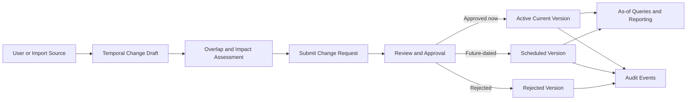
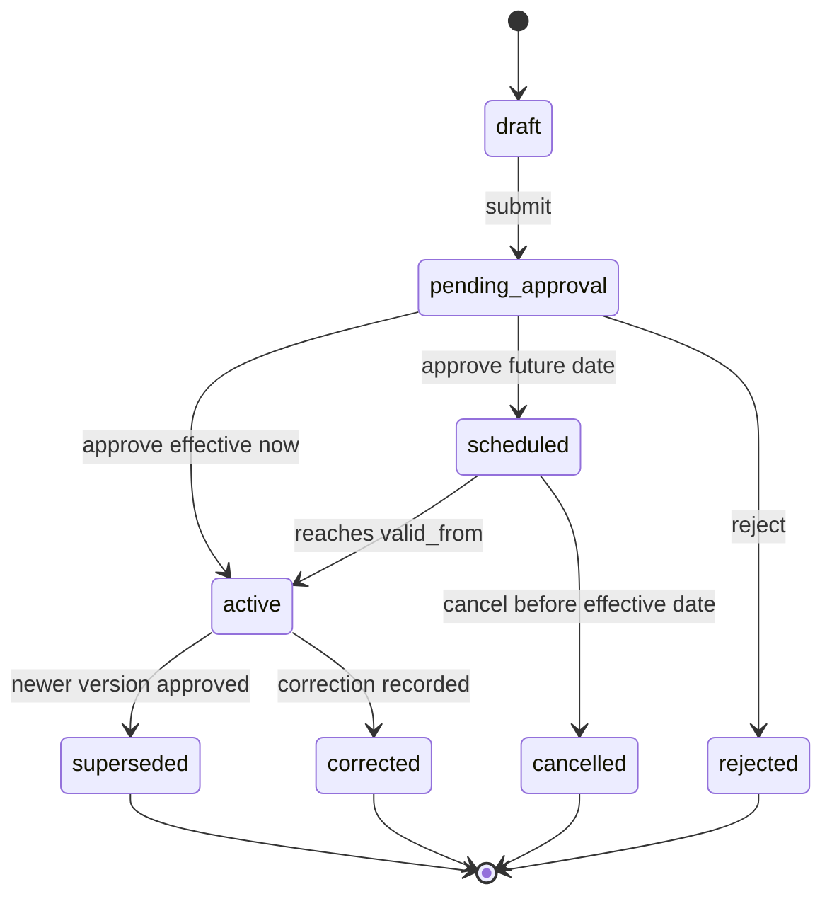
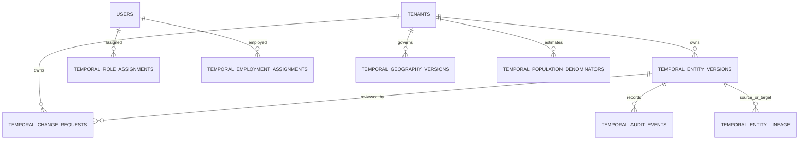

# VaxPlan Enterprise Time Dimension and Historical Reference Data Framework

Status: Implemented as an additive framework on 2026-07-19.

## 1. Purpose

VaxPlan now has an enterprise temporal layer for reference and operational planning data. The framework supports the question: what was true, what is true now, what will become true in future, and when did VaxPlan learn or approve that fact?

This is implemented as a bitemporal model:

- Valid time: `valid_from` and `valid_to` describe the real-world effective period of a facility, district, role, population denominator, boundary, or other record.
- System time: `recorded_at` and `recorded_until` describe when VaxPlan stored and trusted the version.
- Governance state: `status`, `is_current`, `is_future`, `is_correction`, `change_type`, reason fields, approvers, and source metadata support workflow, audit, and rollback without deleting history.

## 2. Current-State Assessment

The source code already had tenant scoping, role-based access control, audit logs, notifications, facilities, settlements, administrative boundaries, population data, microplans, session plans, stock, supervision, reports, and imports. Most domain tables used in-place updates, which are efficient for day-to-day operation but do not preserve future-dated changes, corrections, or full historical reconstruction.

The temporal framework is additive. Existing working tables remain the operational source for current workflows. Temporal tables provide versioned reference truth, workflow, evidence, and as-of query capability. This avoids breaking the map, microplanning wizard, logistics, or reporting screens while enabling gradual module-by-module adoption.

## 3. Temporal Entity Inventory

| Domain | Existing examples | Temporal treatment | Priority |
|---|---|---|---|
| Staff identity | `users`, staff profile fields | version identity corrections and profile state | High |
| Staff employment | facility staff, facility/district/province assignment | `temporal_employment_assignments` with effective dates | High |
| Staff roles and permissions | `user_roles`, user `roles`, `permissions`, scope | `temporal_role_assignments` with valid date and approval | High |
| Administrative geography | regions, provinces, districts, LLGs | `temporal_geography_versions` and generic entity versions | High |
| Boundaries and catchments | boundary GeoJSON, facility catchment polygons | geometry in temporal snapshots or geography versions | High |
| Facilities | facility name, HMIS code, type, status, coordinates | generic entity versions plus source record id | High |
| Communities/settlements | villages, unserved places, mapped communities | generic entity versions with location and source metadata | High |
| Population denominators | `population_data`, raster/model outputs | `temporal_population_denominators` by year, source, geography | High |
| Vaccine schedule/reference | catalogue/config tables | generic entity versions before effective schedule changes | Medium |
| Microplans and sessions | microplans, session plans, approvals | keep operational tables; add temporal snapshots for approved baselines | Medium |
| Stock/logistics reference | stock items, facilities, logistics mappings | version reference setup; transactions remain event records | Medium |
| Integrations/imports | CSV imports, HIS mappings | source metadata and import batch ids in temporal versions | Medium |
| Tenant configuration | tenant settings, notification preferences | generic entity versions for policy-changing settings | Medium |

## 4. Schema Added

The migration `migrations/0015_enterprise_temporal_framework.sql` adds:

- `temporal_entity_versions`: generic bitemporal record versions for facilities, settlements, boundaries, roles, reference tables, and imported datasets.
- `temporal_change_requests`: workflow wrapper for review, approval, rejection, retroactive changes, and impact assessment.
- `temporal_audit_events`: immutable event trail for version creation, submission, approval, correction, cancellation, and rejection.
- `temporal_entity_lineage`: split, merge, transfer, reparenting, and replacement relationships between stable entity ids.
- `temporal_role_assignments`: effective user role and scope assignments over time.
- `temporal_employment_assignments`: effective staff employment and facility/district/province placement history.
- `temporal_geography_versions`: effective administrative hierarchy, codes, names, and GeoJSON geometry history.
- `temporal_population_denominators`: reference-year and effective-date denominator series with source confidence and approval values.

Core fields include `tenant_id`, stable entity identifiers, source record ids, `valid_from`, `valid_to`, `recorded_at`, `recorded_until`, `status`, `is_current`, `is_future`, `is_correction`, `change_type`, `change_reason`, `change_summary`, source document fields, actor fields, approval fields, `snapshot`, `affected_records`, and `metadata`.

## 5. Bitemporal Rules

1. Never overwrite a governed fact when the change has reference-data meaning. Create a new version.
2. Current operational tables may still be updated for live app workflows, but approved temporal versions must preserve the before/after state.
3. A current version is active when `is_current = true`, `recorded_until is null`, and the valid period includes now.
4. A future version has `valid_from` after now and stays `scheduled` until it becomes active.
5. A correction creates a new record with `is_correction = true` and links to the corrected version. The original version is marked `corrected`, not deleted.
6. Retroactive changes require impact assessment because they may alter historical reports, denominators, facility attribution, or supervision scope.
7. Superseded and cancelled rows remain queryable for accountability and audit.

## 6. API Surface

Registered in `server/routes/temporal.ts`:

| Endpoint | Purpose | Permission |
|---|---|---|
| `GET /api/temporal/inventory` | entity inventory and model summary | `temporal.view` |
| `GET /api/temporal/:entityType/:entityId/current` | current trusted version | `temporal.view` |
| `GET /api/temporal/:entityType/:entityId/history` | all versions | `temporal.view_history` |
| `GET /api/temporal/:entityType/:entityId/as-of` | valid-time or system-time reconstruction | `temporal.view_history` |
| `GET /api/temporal/:entityType/:entityId/future` | scheduled future changes | `temporal.view` |
| `GET /api/temporal/:entityType/:entityId/compare` | changed-field comparison | `temporal.view_history` |
| `POST /api/temporal/:entityType/:entityId/versions` | draft version/change proposal | `temporal.propose_change` |
| `POST /api/temporal/versions/:versionId/submit` | submit for approval | `temporal.propose_change` |
| `POST /api/temporal/versions/:versionId/approve` | approve active or scheduled version | `temporal.approve_change` |
| `POST /api/temporal/versions/:versionId/reject` | reject proposed change | `temporal.review_change` |
| `POST /api/temporal/versions/:versionId/correct` | correction without deletion | `temporal.correct_history` |
| `POST /api/temporal/versions/:versionId/cancel` | cancel scheduled future change | `temporal.cancel_future_change` |
| `GET /api/temporal/users/:userId/effective-roles` | roles/scopes as of a date | `temporal.view_history` |
| `GET /api/temporal/population/as-of` | denominator as of date/year/source | `temporal.view_history` |

## 7. Frontend Workflow

The page `client/src/pages/TemporalRecords.tsx` adds a Temporal History Workbench at `/temporal-history` and a sidebar entry under System.

The workbench supports:

- entity type and stable id lookup;
- current version review;
- as-of valid-time reconstruction;
- full history timeline;
- scheduled future changes;
- before/after version comparison.

This is intentionally generic so the first release can support facilities, geography, staff roles, employment, population denominators, and other reference entities without building separate history screens for each module.

## 8. Permissions and Governance

New permissions are registered in the system permission catalogue and role defaults:

- `temporal.view`
- `temporal.view_history`
- `temporal.propose_change`
- `temporal.review_change`
- `temporal.approve_change`
- `temporal.approve_retroactive_change`
- `temporal.correct_history`
- `temporal.cancel_future_change`
- `temporal.export_history`
- `temporal.view_full_audit`
- `temporal.manage_configuration`

Default access:

- National Admin: full temporal governance rights.
- National Manager: view, history, and review rights.
- GIS Specialist: view, history, and proposal rights for spatial/reference updates.

## 9. Architecture Diagrams

### Temporal Data Flow

### Bitemporal State Model

### Data Model Overview

## 10. Migration and Backfill Strategy

1. Apply `0015_enterprise_temporal_framework.sql` with the existing migration runner.
2. Backfill current versions for high-priority records by tenant: facilities, geography, users/roles, staff assignments, settlement records, catchment polygons, and population denominators.
3. Use source record ids to link temporal rows back to existing tables.
4. Set legacy current records to `valid_from = created_at` where available, otherwise use a documented baseline date.
5. Mark generated rows with `source_system = legacy_migration` and `source_type = system_backfill`.
6. Do not delete or rewrite existing operational records during backfill.
7. Run validation queries for duplicate current versions, overlapping valid periods, missing tenant ids, and orphan source record ids.

## 11. Reporting and Analytics Impact

Reports can now support two modes:

- Current-state mode: use live operational tables and current temporal versions.
- Historical/as-of mode: use valid-time filters and population denominator versions to reconstruct the planning context for a selected date or reporting period.

Retroactive changes should trigger review of affected reports where `affected_records` includes microplans, session plans, coverage denominators, catchments, or facility assignments.

## 12. Validation and Test Results

Implemented validation includes:

- effective-period validation (`valid_to` must be after `valid_from`);
- overlap detection for the same tenant/entity/stable id;
- immutable audit events on creation, submission, approval, rejection, correction, and cancellation;
- permission checks on all temporal endpoints;
- TypeScript compile verification with `npm run check`.

## 13. Operational Risks and Mitigations

| Risk | Mitigation |
|---|---|
| Incorrect retroactive changes alter historical interpretation | require approval and impact assessment for retroactive versions |
| Duplicate current versions | partial unique index on tenant/entity/stable id where current and open-recorded |
| Role escalation through history tools | explicit `temporal.*` permissions and tenant context checks |
| Large JSON snapshots reduce query performance | index stable ids and dates; move module-specific frequently queried fields into specialized temporal tables |
| Confusion between valid time and recorded time | UI labels separate "effective date" and "recorded date" modes |
| Import overwrite risk | source metadata and `source_system` fields preserve provenance |

## 14. Implementation Files

- `shared/schema.ts`: temporal table definitions and insert/select types.
- `migrations/0015_enterprise_temporal_framework.sql`: database migration.
- `server/services/temporalService.ts`: bitemporal query, workflow, correction, audit, and comparison service.
- `server/routes/temporal.ts`: secured temporal API endpoints.
- `server/routes.ts`: temporal route registration and system permission catalogue entries.
- `shared/permissions.ts`: default role permissions for temporal governance.
- `client/src/pages/TemporalRecords.tsx`: frontend Temporal History Workbench.
- `client/src/App.tsx`: route registration.
- `client/src/components/AppSidebar.tsx`: sidebar entry.

## 15. Next Adoption Steps

1. Add module-specific temporal hooks to facility edit, boundary manager, staff management, population import, and catalogue configuration save actions.
2. Add scheduled activation job for future versions that become effective after midnight in the tenant timezone.
3. Add notification recipients for submitted, approved, rejected, and cancelled temporal change requests.
4. Add a backfill script and migration dashboard for national administrators.
5. Extend reports with explicit `asOfDate` and `populationReferenceYear` filters.
6. Add Playwright coverage for creating a future facility/boundary change and viewing it in the timeline.
