# VaxPlan Architecture Diagrams

This document contains editable Mermaid diagrams for the VaxPlan application. The diagrams are intended for enterprise technical documentation, implementation planning, architecture reviews, onboarding, and slide-deck use.

For a plain-text database schema reference that does not require Mermaid rendering, see [VaxPlan Database Schema Reference](./vaxplan-database-schema.md).

## 1. System Context

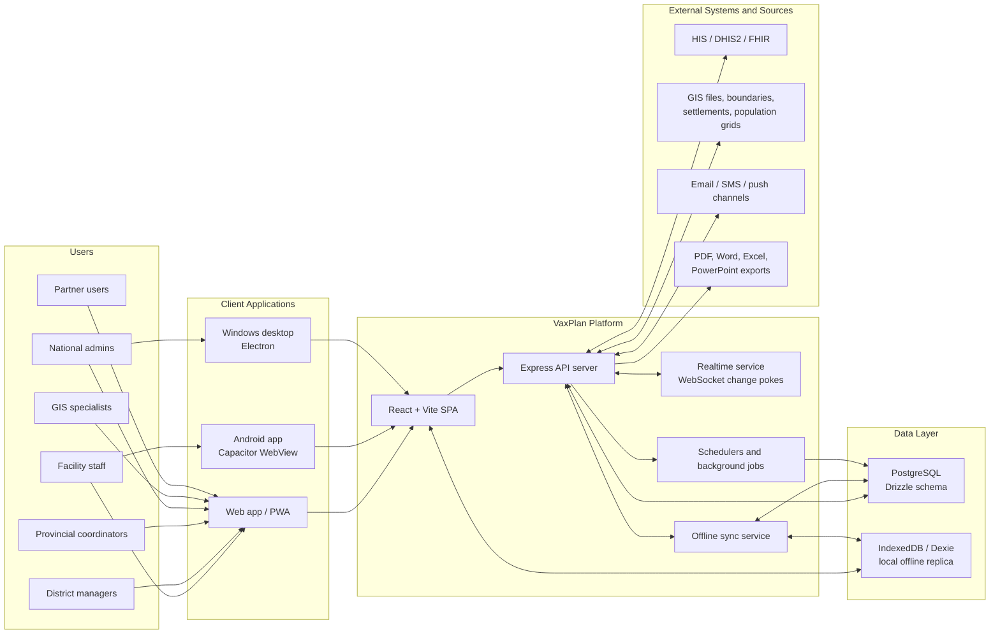

## 2. Runtime Architecture

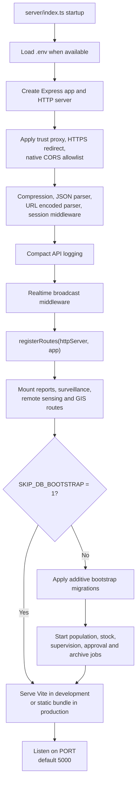

## 3. Frontend Application Shell

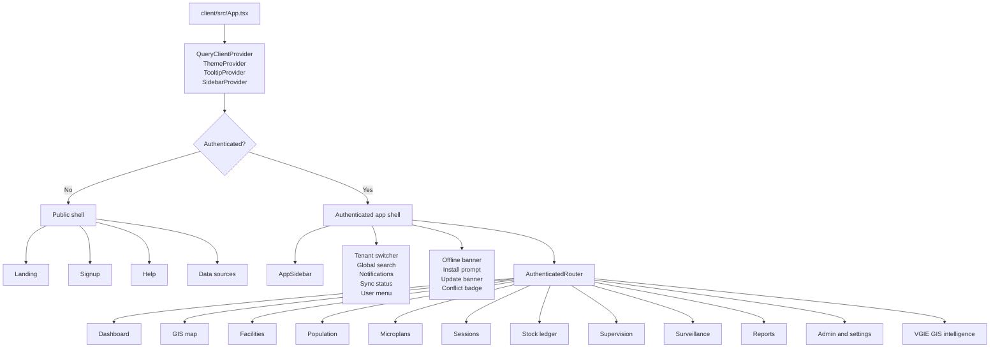

## 4. Backend API Modules

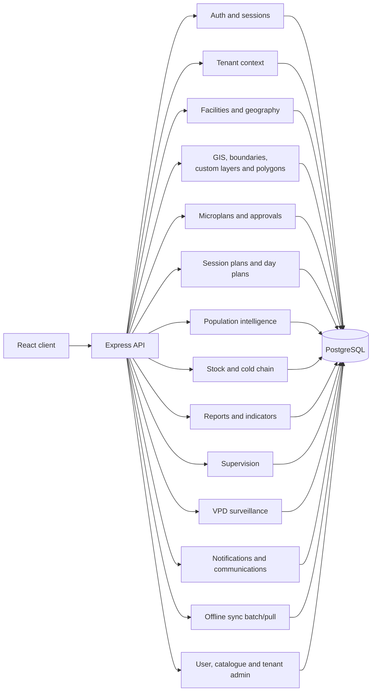

## 5. Enterprise Data Model Overview

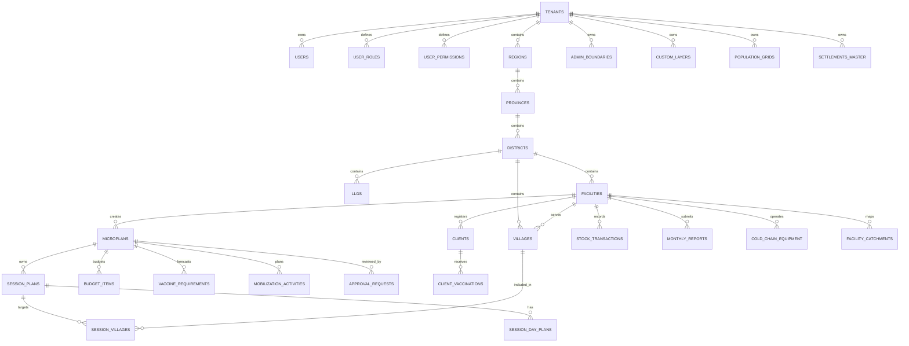

## 6. RBAC and Geographic Access Control

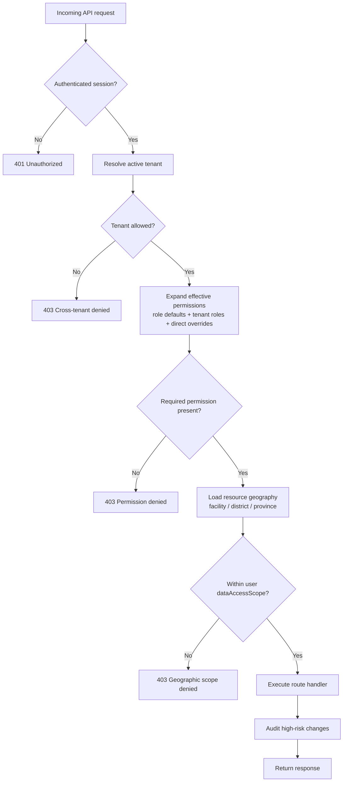

## 7. Offline-First Synchronization

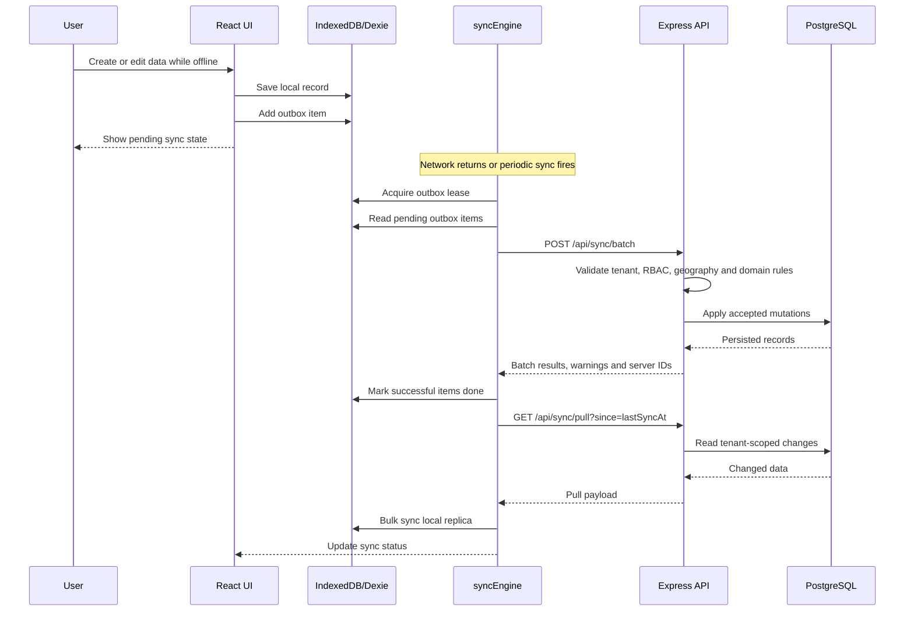

## 8. GIS and Catchment Intelligence

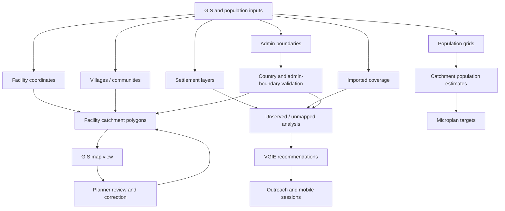

## 9. Microplanning Workflow

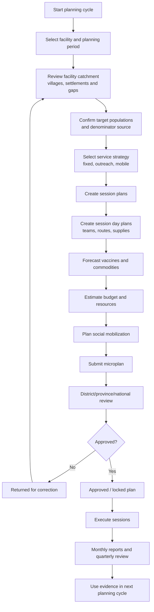

## 10. Deployment Topology

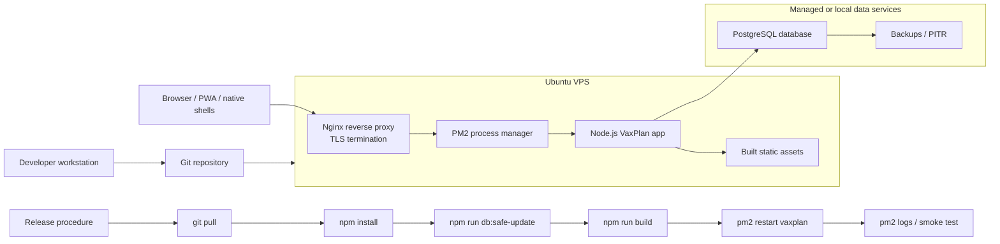

## 11. Integration Architecture

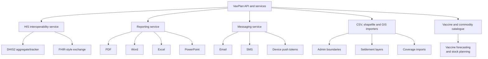

## 12. Scheduler and Background Job Model

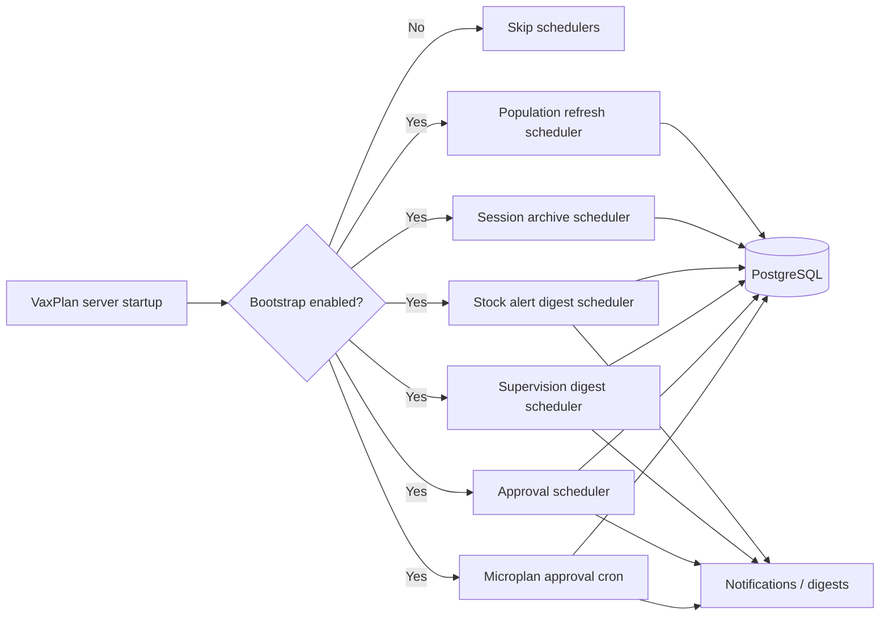

## 13. Source-Code Schema Inventory

The canonical schema source is `shared/schema.ts`. The table list below is grouped by enterprise domain so architects can quickly identify ownership, access-control needs, sync behavior, and reporting impact.

| Domain | Tables / Schemas | Notes |
|---|---|---|
| Tenant control plane | `tenants`, `tenant_idp_configs`, `signup_requests`, `tenant_interest_requests` | Tenant identity, country workspace setup, IdP configuration, onboarding and interest capture. |
| Auth, users and devices | `sessions`, `users`, `user_roles`, `user_permissions`, `device_tokens` | Session state, account profile, role assignments, direct permissions, notification devices. |
| Administrative geography | `regions`, `provinces`, `districts`, `llgs`, `facilities`, `villages`, `facility_excluded_villages` | Country geography hierarchy, health facilities, communities, and explicit catchment exclusions. |
| Microplanning | `microplans`, `session_plans`, `session_villages`, `session_day_plans`, `budget_items`, `vaccine_requirements`, `mobilization_activities`, `approval_requests`, `annual_immunization_plans`, `quarterly_reviews` | Facility/campaign planning cascade, session planning, day planning, resources, budgets, vaccines, mobilization and approvals. |
| GIS and catchment intelligence | `admin_boundaries`, `custom_layers`, `facility_catchments`, `gis_polygons`, `catchment_conflicts`, `settlements_master`, `population_grids`, `candidate_unmapped_settlements`, `imported_coverage`, `csv_imports`, `vgie_settlement_facility_links`, `vgie_recommendations`, `vgie_alerts`, `vgie_recommendation_rules`, `vgie_alert_rules` | GIS boundaries, country layers, facility polygons, settlement intelligence, imported coverage, unmapped community detection, recommendations and alerts. |
| Population planning | `population_data`, `population_refresh_jobs` | Denominator data, population-source traceability, population-grid refresh and status tracking. |
| Service delivery | `clients`, `client_vaccinations` | Client registry and individual vaccination events. |
| Stock, logistics and catalogue | `stock_transactions`, `monthly_reports`, `cold_chain_equipment`, `catalogue_vaccines`, `catalogue_schedule_doses`, `catalogue_commodities`, `catalogue_wastage_thresholds`, `vaccine_configurations` | Stock ledger, routine reporting, cold chain, tenant vaccine schedule, commodities and wastage thresholds. |
| Workforce and community systems | `facility_staff`, `hfc_committee_members`, `chv_profiles`, `uncovered_communities`, `hfc_committee`, `community_health_volunteers` | Health facility staffing, committees, community health volunteers, uncovered communities. |
| Supervision and surveillance | `supervision_visits`, `supervision_checklist_templates`, `vpd_linelist_templates`, `tenant_vpd_configurations`, `surveillance_cases`, `lab_samples` | Supportive supervision, checklist configuration, VPD surveillance line lists, cases and lab samples. |
| Notifications and communications | `notifications`, `message_templates`, `communications`, `communication_channels`, `delivery_logs`, `communication_logs` | Workflow notifications, message templates, outbound communication channels, delivery audit. |
| Research and knowledge hub | `research_documents`, `pilot_activities`, `pilot_updates`, `implementation_lessons`, `download_assets`, `research_interest_submissions`, `research_download_events` | Research hub content, pilot activity tracking, implementation lessons, downloads and engagement. |
| Audit, analytics and reference | `audit_logs`, `page_views`, `indicator_manual` | Audit trail, usage analytics and indicator reference documentation. |

## 14. Key Schema Fields by Domain

For exact definitions, `shared/schema.ts` remains the source of truth. These are the high-impact fields architects and implementers should know.

| Entity | Key Fields | Enterprise Meaning |
|---|---|---|
| `tenants` | `id`, `name`, `code`, `countryCode`, `status`, `settings` | Country or organization workspace. Controls configuration and tenant isolation. |
| `tenant_idp_configs` | `tenantId`, `protocol`, `issuer`, `metadata`, `enabled` | SSO/IdP integration configuration. |
| `users` | `tenantId`, `email`, `firstName`, `lastName`, `role`, `roles`, `permissions`, `dataAccessScope`, `facilityId`, `districtId`, `provinceId`, `isActive`, `passwordHash`, `isPlatformAdmin` | User identity, default and dynamic roles, direct permission overrides, geographic scope and platform-admin status. |
| `user_roles` | `tenantId`, `code`, `name`, `permissions` | Tenant-specific role catalogue. |
| `user_permissions` | `tenantId`, `code`, `name`, `description` | Tenant-specific permission catalogue. |
| `regions`, `provinces`, `districts`, `llgs` | `tenantId`, parent geography ID, `name`, `code` | Formal administrative hierarchy used for reporting, map filtering and access scope. |
| `facilities` | `tenantId`, `name`, `hmisCode`, `facilityType`, `districtId`, `latitude`, `longitude`, `catchmentPolygon`, `catchmentGridPopulation`, `externalIds`, `isActive` | Core operational planning unit. |
| `villages` | `tenantId`, `districtId`, `llgId`, `assignedFacilityId`, `latitude`, `longitude`, population fields, geometry/boundary fields | Community or settlement record used for catchment assignment and session targeting. |
| `microplans` | `tenantId`, `facilityId`, `year`, `quarter`, `planType`, `approvalStatus`, target/resource fields | Parent planning object for routine or campaign microplanning. |
| `session_plans` | `tenantId`, `microplanId`, `facilityId`, `name`, `sessionType`, `scheduledDate`, `status` | Planned fixed, outreach or mobile service event. |
| `session_villages` | `tenantId`, `sessionId`, `villageId` | Many-to-many bridge between sessions and target communities. |
| `session_day_plans` | `tenantId`, `sessionPlanId`, `sessionDate`, team/resource fields, actuals fields | Day-level operational plan and execution record. |
| `budget_items` | `tenantId`, `microplanId`, activity/cost/funding fields | Planned resource and budget lines. |
| `vaccine_requirements` | `tenantId`, `microplanId`, vaccine/commodity/quantity fields | Forecasting output for vaccines and supplies. |
| `mobilization_activities` | `tenantId`, `microplanId`, activity, owner, schedule/status fields | Demand generation and community engagement planning. |
| `approval_requests` | `tenantId`, `microplanId`, requester/reviewer/status/comment fields | Structured review and approval workflow. |
| `population_data` | `tenantId`, geography/facility/village context, source, value, category/year fields | Denominator and target population values. |
| `admin_boundaries` | `tenantId`, geography context, boundary source/type, geometry | Administrative polygons used for map display, validation and clipping. |
| `custom_layers` | `tenantId`, category/type/format, metadata, geometry/file fields | Tenant-specific operational GIS layers. |
| `facility_catchments` | `tenantId`, `facilityId`, geometry, metadata | Facility catchment polygons. |
| `gis_polygons` | `tenantId`, polygon type, geometry, metadata | General planning and validation polygons. |
| `settlements_master` | `tenantId`, geography/facility context, coordinates/geometry, population/source fields | Master settlement inventory for missed or unmapped community intelligence. |
| `population_grids` | `tenantId`, source, grid metadata, file/coverage fields | Gridded population datasets used in estimates. |
| `candidate_unmapped_settlements` | `tenantId`, geography, coordinates, match/status fields | Candidate settlements requiring review before conversion or assignment. |
| `imported_coverage` | `tenantId`, geography context, antigen/period/coverage fields | Imported coverage for triangulation and gap detection. |
| `clients` | `tenantId`, `facilityId`, `villageId`, identity/demographic fields, client identifier fields | Individual client registry. |
| `client_vaccinations` | `tenantId`, `clientId`, `facilityId`, vaccine/dose/date/batch fields | Administered antigen and dose records. |
| `stock_transactions` | `tenantId`, `facilityId`, vaccine/commodity, transaction type, quantity, batch, date fields | Stock ledger movements. |
| `monthly_reports` | `tenantId`, `facilityId`, reporting period, service and stock metrics | Routine facility report submission. |
| `cold_chain_equipment` | `tenantId`, `facilityId`, equipment, capacity, status and maintenance fields | Cold chain inventory and readiness. |
| `supervision_visits` | `tenantId`, geography/facility context, checklist, findings, action/status fields | Supportive supervision and corrective action evidence. |
| `surveillance_cases` | `tenantId`, disease, case classification, geography, dates, investigation fields | VPD surveillance case tracking. |
| `lab_samples` | `tenantId`, case reference, collection/shipment/result fields | Laboratory sample tracking. |
| `notifications` | `tenantId`, `userId`, type, title, message, status | User and workflow notification records. |
| `audit_logs` | `tenantId`, actor, action, entity, before/after, timestamp, request metadata | Audit evidence for high-risk changes. |

## 15. Key Enumerations

| Enum | Values / Purpose |
|---|---|
| `tenant_status` | Tenant lifecycle state. |
| `idp_protocol` | `oidc`, `saml`. |
| `signup_status` | Signup request lifecycle state. |
| `population_refresh_status` | Population-refresh job lifecycle state. |
| `population_refresh_trigger` | Reason/source of a population refresh. |
| `user_role` | `facility_clerk`, `facility_in_charge`, `district_manager`, `provincial_coordinator`, `national_admin`, `gis_specialist`, `facility_partner`, `district_partner`, `provincial_partner`, `national_partner`, `national_manager`. |
| `approval_status` | `draft`, `pending`, `approved`, `rejected`, `locked`, `under_review`, `returned`, `archived`, `superseded`. |
| `session_type` | `static`, `mobile`, `outreach`. |
| `transport_mode` | `walking`, `road`, `car`, `motorbike`, `donkey`, `boat`, `air`, `chopper`. |
| `population_source` | `nso`, `hmis`, `worldpop`, `survey`, `community_census`. |
| `microplan_type` | Distinguishes routine facility plans from campaign/SIA plans. |
| `session_plan_type` | Distinguishes routine and campaign session plan semantics. |
| `funding_source` | Funding source classification for budget lines. |
| `boundary_source` | Source classification for boundaries. |
| `custom_layer_category` | Category classification for custom GIS layers. |
| `custom_layer_type` | Geometry/layer type classification for custom layers. |
| `custom_layer_format` | Import/file format classification for custom layers. |
| `vpd_diseases` | Vaccine-preventable disease list for surveillance configuration. |
| `case_classification` | Surveillance case classification. |
| `commodity_type` | `diluent`, `syringe`, `safety_box`, `ppe`, `cold_chain`, `other`. |
| `dose_classification` | `routine`, `campaign`, `outbreak`, `school_based`, `other`. |
| `gis_polygon_type` | Planning/validation polygon classification. |

## 16. Detailed Domain ERDs

### 16.1 Tenant and User Domain

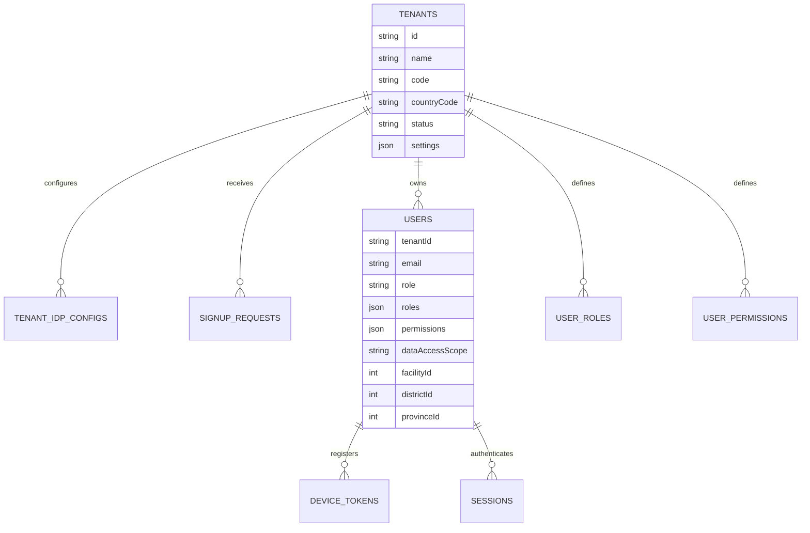

Key rules:

- A normal user operates inside one active tenant context.
- Direct permissions may extend or override role-derived capabilities.
- Geographic scope is separate from permission scope.
- Platform administration should be reserved for explicitly privileged accounts.

### 16.2 Geography, Facility and Community Domain

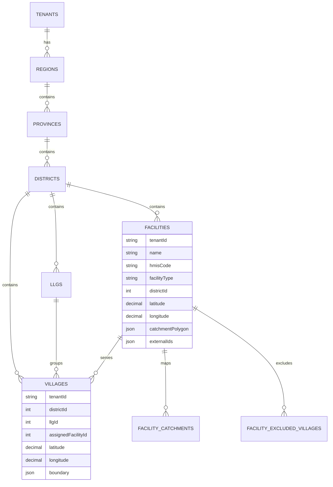

Key rules:

- Facility and village data should always be filtered by active tenant.
- Facility coordinates and catchment polygons are high-impact planning fields and should be audited.
- Community assignment changes affect session planning, population estimates, reports and missed-community analysis.

### 16.3 Microplanning and Session Domain

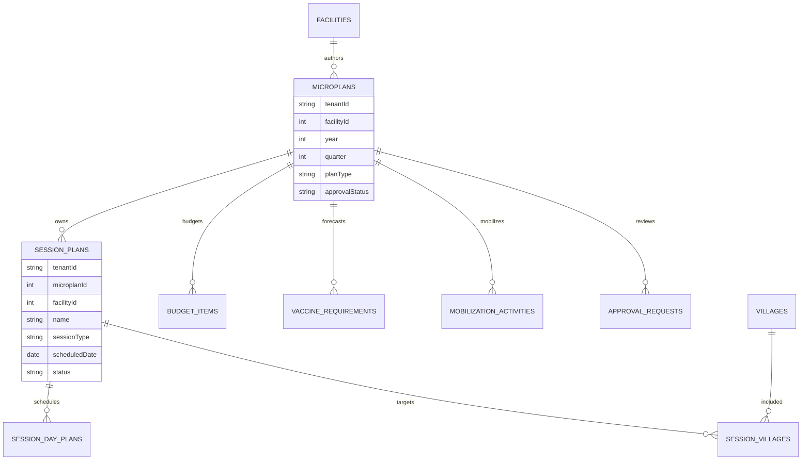

Key rules:

- A session plan should belong to a parent microplan.
- Session plan type should match parent microplan type.
- Approved or locked microplans should constrain downstream session edits.
- Budget, vaccine requirement and mobilization data should not be interpreted outside the parent microplan.

### 16.4 GIS and Population Intelligence Domain

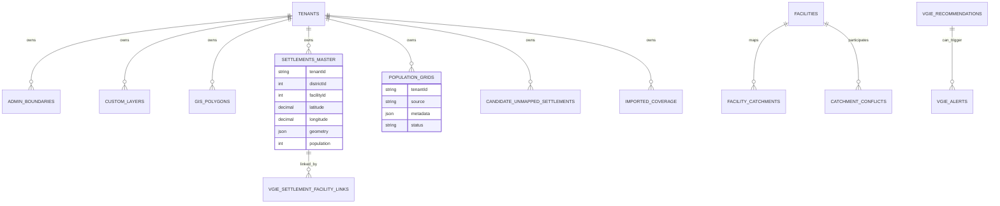

Key rules:

- Settlement and unserved-place outputs must be constrained to the active tenant/country boundary.
- Imported coverage should be treated as triangulation evidence, not as a silent replacement for operational reports.
- Population-grid outputs must retain source and vintage metadata.
- Catchment conflict records should be actionable, reviewed and auditable.

### 16.5 Service Delivery, Stock and Reporting Domain

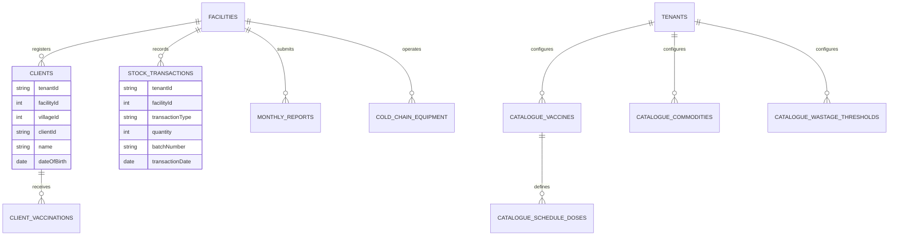

Key rules:

- Client-level data needs tighter privacy controls than aggregate planning data.
- Stock transactions should be append-oriented where possible to preserve audit history.
- Monthly reports should be locked or versioned after formal submission/review.
- Catalogue changes affect forecasting, reports and validation of vaccination events.

### 16.6 Supervision, Surveillance and Communications Domain

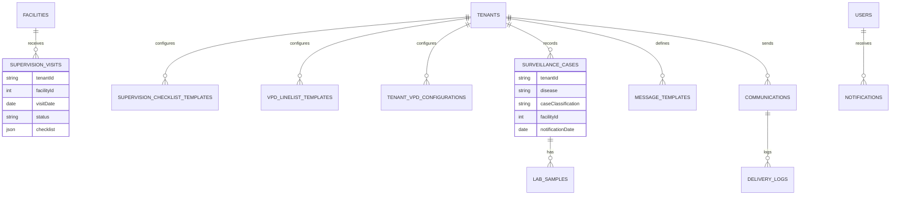

Key rules:

- Supervision findings should lead to corrective action and closure status.
- Surveillance cases and lab samples should preserve investigation timelines.
- Notification and communication logs provide operational accountability.

## 17. Offline Local Schema and Sync Payload

The offline database is defined in `client/src/lib/offlineDb.ts`; synchronization orchestration is in `client/src/lib/syncEngine.ts`.

| Offline Entity / Structure | Purpose |
|---|---|
| `outbox` | Stores offline mutations with tenant ID, entity type, method, URL, serialized body, local ID, server ID, retry count and error state. |
| `conflictLog` | Records local and server snapshots when conflicts are resolved or local data is overwritten. |
| `syncMeta` | Stores last sync time, active synced tenant and database fingerprint metadata. |
| Local facility mirror | Offline-readable facility records. |
| Local village mirror | Offline-readable villages, coordinates and outreach-post fields. |
| Local client mirror | Client registration data and optional resolved geography names. |
| Local vaccination mirror | Vaccination events queued or synced offline. |
| Local session plan mirror | Session plan fields required for offline session management. |
| Local session day plan mirror | Day-level operational planning and execution fields. |
| Local stock transaction mirror | Offline stock ledger movement records. |

Pull sync payload families include `regions`, `provinces`, `districts`, `llgs`, `facilities`, `villages`, `clients`, `clientVaccinations`, `sessionPlans`, `sessionDayPlans`, `budgetItems`, `mobilizationActivities`, `stockTransactions`, `monthlyReports`, `populationData`, `vaccineConfigs` and `databaseFingerprint`.

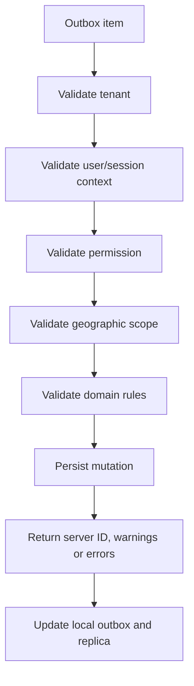

## 18. Permission and Role Summary

Default permissions are declared in `shared/permissions.ts`. The authorization layer combines built-in role permissions, tenant-defined role permissions, direct user overrides, tenant context and geographic scope.

| Role Family | Typical Scope | Typical Capabilities |
|---|---|---|
| Facility clerk | Facility | Clients, sessions, stock, mobilization and basic facility workflows. |
| Facility in-charge | Facility | Facility-level approval, reports, budget/resource planning and local management. |
| District manager | District | District review, approvals, reports, supervision and oversight. |
| Provincial coordinator | Province | Provincial oversight, reporting, approvals and selected management functions. |
| National admin / national manager | National tenant | National reporting, user/admin operations, catalogues, GIS oversight and standards alignment. |
| GIS specialist | Tenant or assigned geography | Boundaries, GIS layers, catchments and settlement intelligence. |
| Partner roles | Assigned geography | Read-oriented program visibility and reporting, generally without broad administrative privileges. |

## 19. Route and Module Map

| Frontend Module | Main Data Domains | Backend / Service Areas |
|---|---|---|
| Dashboard | Reports, microplans, sessions, stock, geography | Core routes, reporting service |
| Map | Facilities, villages, catchments, custom layers, settlements, population grids | GIS routes, VGIE routes, population intelligence service |
| Facilities | Facilities, villages, staff, catchments, cold chain | Facility routes, GIS polygon/catchment routes |
| Population | Population data, population grids, imported coverage | Population intelligence and refresh jobs |
| Microplan Wizard/List | Microplans, budgets, vaccines, mobilization, approvals | Microplan routes, approval services |
| Session Planning | Session plans, session villages, session day plans | Session routes, proximity checks, sync replay rules |
| Stock Ledger | Stock transactions, vaccine catalogue, commodities, monthly reports | Stock and catalogue routes |
| Supervision | Supervision visits, checklist templates | Supervision routes and digest job |
| Surveillance | VPD templates, cases, lab samples | Surveillance router |
| Reports | Monthly reports, indicators, exports | Reports router and reporting service |
| User Management | Users, roles, permissions, tenant context | Auth/admin routes, authorization service |
| HIS Integrations | Imported coverage, HIS mappings, reports | HIS interoperability service |
| Research Hub | Research documents, pilots, updates, lessons, downloads | Research routes/schema |

## 20. Environment, Runtime and Deployment Keys

| Key / Script | Purpose |
|---|---|
| `DATABASE_URL` | Required PostgreSQL connection string. Supabase/Upstash-style URLs automatically receive `sslmode=require` when missing. |
| `PORT` | Server listen port; defaults to `5000`. |
| `NODE_ENV` | Controls production behavior such as HTTPS redirect and static serving. |
| `SKIP_DB_BOOTSTRAP=1` | Disables bootstrap migrations and scheduler startup. |
| `npm run dev` | Runs `tsx --env-file=.env server/index.ts` for local development. |
| `npm run build` | Runs the production build script. |
| `npm run start` | Runs production bootstrap and starts compiled server output. |
| `npm run check` | TypeScript check. |
| `npm run test` | Vitest test runner with `.env`. |
| `npm run db:safe-update` | Production-safe additive migration path per deployment guide. |
| `npm run db:generate` | Drizzle migration generation. |
| `npm run db:migrate` | Migration runner. |
| `npm run cap:sync` | Build and synchronize Capacitor native shell. |
| `npm run electron:dev` | Runs web dev server plus Electron development shell. |

Deployment guardrails:

- Do not wipe production data.
- Do not overwrite official values without explicit approval.
- Prefer additive migrations.
- Avoid direct destructive `drizzle-kit push` operations in production.
- Smoke test tenant login, map, facility edit, microplanning, session planning, stock, reports and sync status after deployment.

## 21. Enterprise Data Governance Notes

| Area | Required Control |
|---|---|
| Tenant isolation | Every tenant-scoped query must filter by active tenant. |
| Geographic access | Province, district and facility records must be checked against user scope. |
| Facility coordinates and catchments | Treat as high-risk planning fields; audit changes. |
| Official population values | Protect from accidental overwrite; track source and vintage for alternatives. |
| GIS layers | Validate geometry, source, country boundary fit and tenant ownership. |
| Client data | Minimize PII, restrict exports and enforce role/geography access. |
| Stock data | Preserve ledger history and avoid destructive stock edits. |
| Reports | Lock/version submitted reports where required for official review. |
| Offline replay | Re-run authorization and domain validation during sync batch replay. |
| Audit logs | Capture actor, action, entity, before/after and timestamp for high-risk operations. |

## 22. Architecture Review Checklist

- Does every API path enforce authentication where required?
- Does every tenant-scoped entity filter by active tenant?
- Does every update path enforce RBAC and geographic scope?
- Are facility pin moves, catchment polygon changes and assignment changes audited?
- Are unserved settlements clipped or validated to the active tenant/country boundary?
- Do offline replay paths enforce the same rules as online API writes?
- Are approved or locked microplans protected from unauthorized child-session edits?
- Are imports validated for duplicates, malformed geometry and wrong-country data?
- Do reports use structured records rather than visual map state?
- Are production migrations additive unless explicitly approved?

