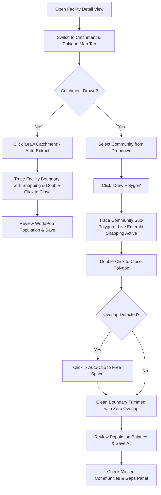

# Intelligent Polygon Drawing & Spatial Catchment Lifecycle Walkthrough

## 1. Module Purpose & Core Concepts

The **Catchment Map & Polygon Drawing** tool in VaxPlan provides an enterprise-grade, topological GIS editing environment designed for health facility managers and GIS officers to trace, validate, and manage operational boundaries without spatial errors.

### Core Geospatial Innovations:
1. **Zero Overlap Topological Enforcement**: Strict topology rules prevent overlapping community boundaries and neighboring health facility catchment collisions.
2. **Live Vertex & Boundary Edge Snapping**: As you draw or edit vertices, the cursor automatically snaps to adjacent catchment boundaries or sibling community borders within an 18-pixel screen threshold (highlighted with an emerald green snap point), eliminating micro-gaps and sliver polygons.
3. **1-Click Auto-Clip to Free Space (`⚡ Auto-Clip to Free Space`)**: Instantly trims any overlapping portions of a newly digitized community boundary against all neighboring polygons and the parent facility boundary in a single click using Boolean geometry difference operations (`turf.difference` and `turf.intersect`).
4. **Missed Communities & Zero-Dose Spatial Gap Detection**: Point-in-Polygon spatial analysis automatically classifies settlements into **Enclosed**, **Unzoned In-Catchment**, and **Orphaned Zero-Dose** places, highlighting interior gaps on the map with red hatched overlays.
5. **High-Resolution WorldPop Demographics Cascade**: Automatically queries local GeoTIFF grids and WorldPop APIs to extract total population, under-1 infants, and under-5 cohort estimates for every drawn boundary.
6. **Multi-User Collaborative Governance**: Governed versioning (`Draft` -> `Submitted for Review` -> `Active` / `Approved` -> `Replaced` / `Archived`) ensures operational polygons are never destructively overwritten and changes are instantly visible across all authorized users.

---

## 2. Step-by-Step Guide: Drawing & Managing Polygons

### Step 1: Accessing the Catchment Map Panel
1. Navigate to **Facilities** from the main sidebar.
2. Search and select your target Health Facility.
3. In the facility detail view, scroll to the **Catchment Map & Communities** panel.

### Step 2: Drawing the Health Facility Primary Catchment
1. If the facility does not have a catchment boundary, click the blue **"Draw Catchment"** button (or click **"⚡ Extract Communities"** to automatically scrape settlement points and generate suggested buffers).
2. The cursor changes to a crosshair. Click on the map to place each boundary vertex along roads, rivers, administrative divisions, or geographic features.
3. **Interactive Controls During Drawing**:
   - **Ctrl + Z** (or `Cmd + Z`): Undo the last placed vertex.
   - **Escape (`Esc`)**: Cancel drawing mode.
   - **Emerald Snap Marker**: Hover near existing district or neighboring boundaries to snap vertices exactly.
4. **Double-Click** on the last point to close and complete the polygon.
5. Review the auto-calculated **Grid Population** and **Under-5 Cohort** displayed in the popup.
6. Click **"Save Catchment"** to create and persist the active facility boundary.

### Step 3: Drawing Community Sub-Polygons with Live Snapping
1. In the **Community** dropdown selector, choose the village or community you wish to demarcate.
2. Click the orange **"Draw Polygon"** button.
3. Click on the map to trace the community's territory inside the health facility catchment.
4. **Live Snapping**: When moving the cursor within 18 pixels of the outer facility border or an adjacent community boundary, an **emerald green circle marker** will appear at the exact snap coordinate. Click to lock the vertex directly onto the existing border.
5. **Double-Click** to finish and close the community polygon.

### Step 4: Resolving Overlaps with 1-Click Auto-Clipping
1. If a drawn community polygon accidentally extends into a neighboring community or outside the facility catchment, a warning banner will appear.
2. Click the **"⚡ Auto-Clip to Free Space"** button on the toolbar.
3. VaxPlan's server-side spatial engine will instantly calculate the difference between the drawn polygon and all existing sibling polygons, cleanly trimming away overlapping fragments while preserving the interior shape.
4. A confirmation toast will indicate the exact square kilometers trimmed (e.g., `Trimmed 1.42 km² of overlap against 3 neighboring boundaries`).

### Step 5: Auditing Missed Communities & Spatial Coverage Gaps
1. Look below the map at the **"🎯 Missed Communities & Gap Analysis"** panel.
2. **Review Metrics**:
   - **Uncovered Catchment Area**: Total square kilometers within the facility boundary that have not been assigned to any community polygon (rendered as a red-hatched overlay on the map).
   - **Orphaned Zero-Dose Places**: Settlements and hamlets located outside all known facility catchments (indicated by red circle markers).
   - **Unzoned In-Catchment Places**: Villages falling inside the facility boundary that have no dedicated sub-polygon (indicated by amber circle markers).
3. Click on any flagged settlement in the listing or map to view its estimated population and distance to the health facility.
4. Draw or adjust community sub-polygons to encompass these missed settlements.

### Step 6: Population Balance Verification & Saving
1. Check the **Population Coverage Balance** bar:
   - **Green (>=90%)**: High population coverage attribution.
   - **Amber (50%–89%)**: Partial community attribution.
   - **Red (<50%)**: Substantial population unassigned.
2. Click **"Save All"** (or save individual community polygons).
3. The polygons are saved to the persistent database and synchronized across all active users.

---

## 3. Vertex Editing, Replacement & Governance Lifecycle

| Action | How to Use | Governance Result |
| :--- | :--- | :--- |
| **Edit Vertices** | Select community -> Click `Edit vertices` -> Drag white handles -> Click `Save` | Creates a new **Draft Version** for minor boundary corrections. |
| **Replace Boundary** | Select community -> Click `Replace` -> Draw new boundary from scratch | Creates a replacement proposal linked to the previous version. |
| **Submit for Review** | In the version notification banner, click `Submit for approval` | Moves status to `Submitted for Review` and alerts District/GIS managers. |
| **Approve / Reject** | Authorized GIS Specialists or District Managers click `Approve` or `Reject` in the History drawer | **Approval** makes the version active; **Rejection** marks it `Needs Correction`. |
| **Compare Versions** | Open `History` -> Click `Compare latest versions` | Side-by-side visual diff showing area and population delta plus affected microplans. |

---

## 4. Keyboard Shortcuts & Quick Reference

| Shortcut / Control | Function |
| :--- | :--- |
| **Left Click** | Place a polygon vertex (snaps automatically when near an existing edge). |
| **Double Click** | Close and finalize the current polygon. |
| **Ctrl + Z / Cmd + Z** | Undo the last placed vertex while drawing. |
| **Escape (`Esc`)** | Cancel the active drawing session without saving. |
| **Show / Hide Gaps** | Toggle red-hatched overlay of unzoned catchment territory. |
| **Buffer Selector** | Change extraction buffer radius (`0.5 km` to `25.0 km`) for settlement harvesting. |
| **Basemap Switcher** | Toggle between Positron light vector tiles, OpenStreetMap, and Satellite imagery. |

---

## 5. Troubleshooting & FAQ

> [!TIP]
> **Why is my community polygon blocked from saving?**
> A community polygon cannot be saved if it self-intersects (figure-eight shape) or if it has an unresolved overlap with an existing approved community. Use the **`⚡ Auto-Clip to Free Space`** button to automatically trim overlaps, or press `Ctrl+Z` while drawing to reposition vertices.

> [!NOTE]
> **How do other users see my drawn polygons?**
> As soon as you click **Save** or **Save All**, the polygons are written to the database and invalidate the shared query cache. When other users open the facility or district map, the latest active and approved polygons render immediately.
